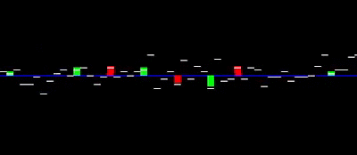

<div align="center">

# Trading Simulator



</div>

This is a simple trading simulator with visualiser in OpenCV. It allows one to buy and sell stock. By default, it uses two different uniform distributions based on if the price is above or below expected value to minimise the risk of the value straying too far away from its intrinsic value.

The sum of 10 single-digit numbers is used by default to determine the range of possible values (and the default expected value depends on this.)

To use a different number generator (i.e. different distribution), overwrite Simulator.number_generator and Simulator.get_expected_value function to replace the number generator and its expected value.

Buys and sells are coloured green and red (respectively) regardless of value relative to expected value.

All trades are logged and stored into a CSV with columns for the value when bought and sold.

### Installation

```
git clone git@github.com:JeffreyWardman/trading_simulator.git
cd trading_simulator
python3 -m pip install -r requirements.txt
```

### Usage

`python3 simulator.py --n_max 10 --n_min 0 --n_ticks 100 --t_update 0.02 --image_shape 250,1000 --show_expected_value_line True`

(All arguments are optional)

Hotkeys in simulator:

- c: Buy
- v: Sell
- s: Position status
- q: Options
- ESC: Quit simulator

### Assumptions

- Market liquidity is plentiful.
- Intrinsic value is constant.
- Market is in a neutral state (neither bull/bear market).

### Further Extensions

- Limit resources
  - Currently it is assumed that the market liquidity is not an issue.
- Liquidate if position is margin called.
- Puts and calls (with leverage)
  - Factorise so if position is negative, then started with shorting.
- Parallelise and further optimisations to improve runtime, seperate the processes of ordering and the simulator itself.
- Better annotations (arrows, text) for buy, sell, settle positions.
- Use a range of values from current position to determine the required scale price-wise in the image.
  - Current assumption that price stays close to intrinsic value avoids this requirement.
